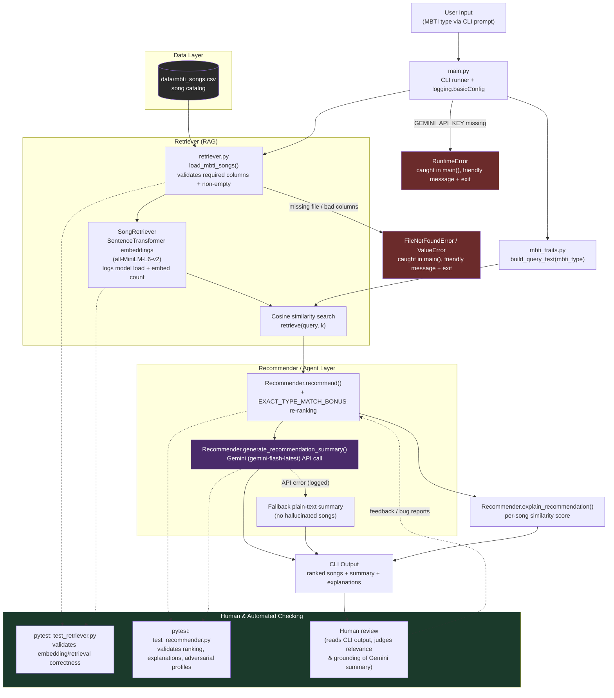

# System Diagram — MBTI Music Recommender

## Component summary

- **CLI (`main.py`).** This is the entry point. It sets up logging, prompts
  the user for an MBTI type, connects the other components together, and
  prints the results. It wraps the whole run in a try/except block, so a
  missing catalog file, a missing `GEMINI_API_KEY`, or a `Ctrl+C` all
  produce a clear message and a clean exit instead of a raw traceback.
- **Data (`data/mbti_songs.csv`).** This is the song catalog. Each row has
  a title, an artist, an MBTI type, trait tags, and a description.
- **Retriever (`retriever.py`).** This loads the catalog, checks that it
  has the required columns, and rejects it if it is empty, all before any
  embedding work starts. It embeds each song's traits and description
  locally with `sentence-transformers`, then does a cosine similarity
  search against a query built from the requested MBTI type. It logs the
  catalog size, the model load, and embedding progress.
- **Recommender (`recommender.py`).** This takes the retrieved results and
  re-ranks them with a small bonus for exact MBTI type matches. It then
  calls the Gemini API to write a short summary that is grounded in the
  retrieved songs. If the Gemini call fails, it logs the error and falls
  back to a plain, non-LLM summary instead.
- **Guardrails.** A bad or missing CSV file, an empty catalog, a missing
  API key, and Gemini API failures are all caught and handled on purpose,
  instead of letting the CLI crash with a raw traceback.
- **Verification.** `tests/test_retriever.py` and `tests/test_recommender.py`
  automatically check that retrieval and ranking work correctly. A human
  also reviews the final CLI output to judge whether the recommendations
  and the generated summary actually make sense and stay grounded in the
  retrieved songs.

## Data flow

1. The user enters an MBTI type into `main.py`, which has already set up
   logging at startup.
2. `main.py` loads songs from the CSV file using `retriever.load_mbti_songs`
   and `recommender.load_songs`. A missing file or a malformed catalog is
   caught and reported cleanly.
3. `mbti_traits.build_query_text` turns the MBTI type into a query string.
4. `SongRetriever` embeds the query and the catalog, then returns the
   top-k songs ranked by cosine similarity.
5. `Recommender` re-ranks those results with the exact-type bonus, then
   asks Gemini to write a grounded summary. If the Gemini call fails, it
   falls back to a plain summary instead. A missing `GEMINI_API_KEY` is
   caught at startup with a clear, actionable message.
6. The ranked songs, the summary, and each song's explanation are printed
   to the CLI.
7. Automated tests check the retrieval and ranking logic on every change,
   and a human reads the final output to catch bad or ungrounded
   recommendations before trusting them.
